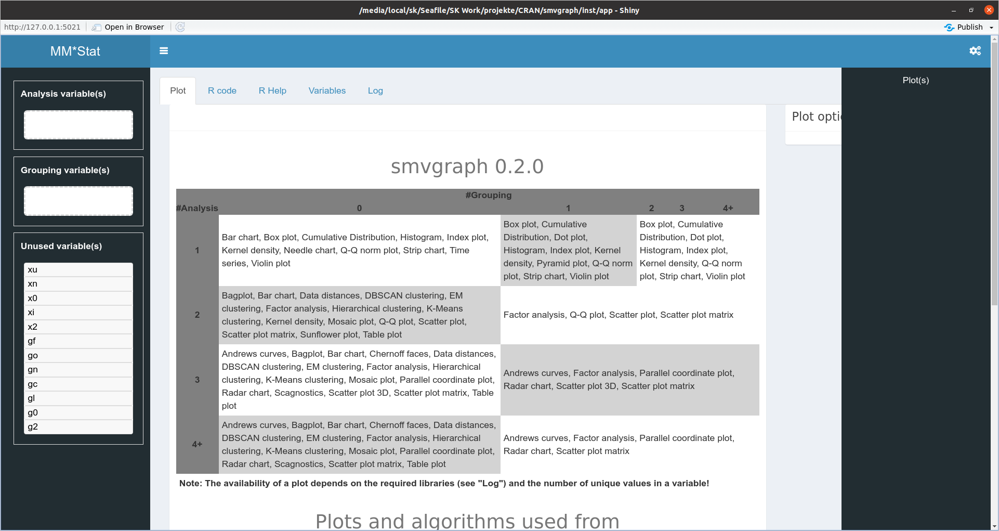
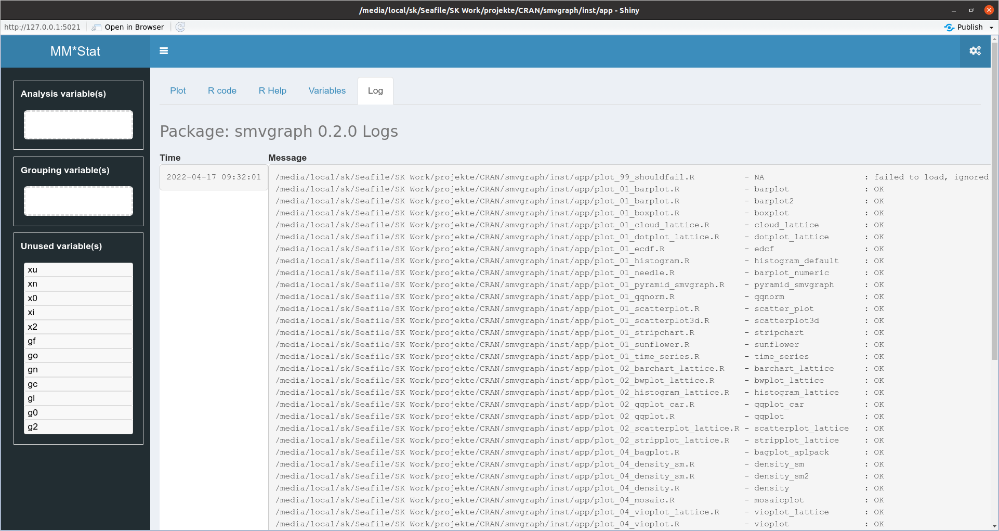
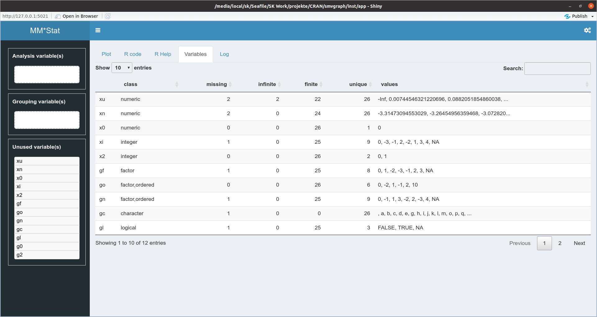
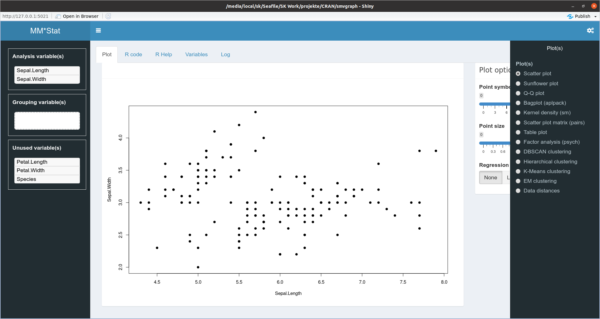
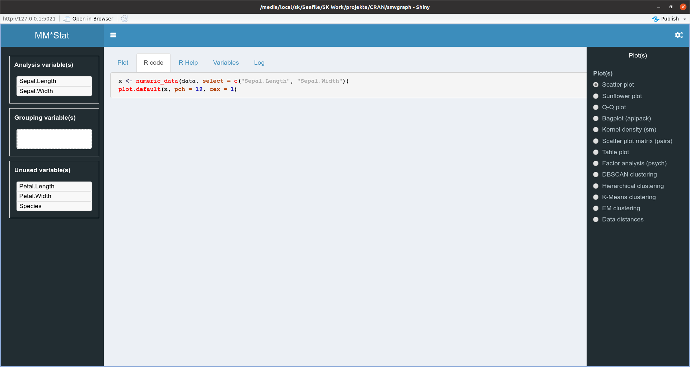
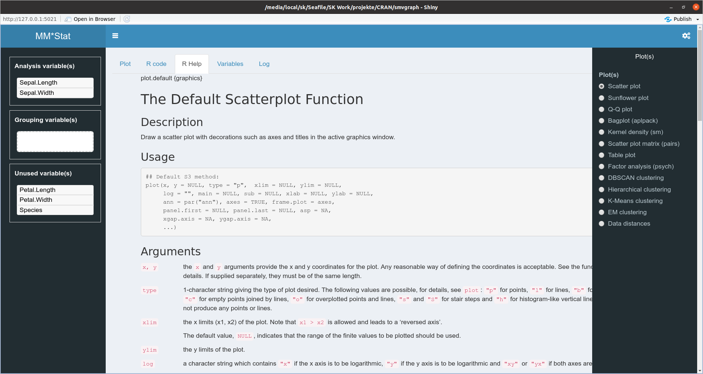

```{r, include = FALSE}
knitr::opts_chunk$set(
  collapse = TRUE,
  comment = "#>"
)
```

```{r setup, include=FALSE}
library(smvgraph)
```

# General

`smvgraph` is a package containing a Shiny app for teaching statistical graphics in basic and advanced statistical courses. 
It contains  only non-`ggplot2` graphics; to learn `ggplot2` graphs see [Learn ggplot2 using Shiny App](http://r-graph.com/). 

A few graphics I use in class were (re)implemented because I could not find a package with a good implementation. Most of the time the
graphs are based on other packages or the basic implementation in R. In addition, you will find a graphical visualisation (usually with principal components) of results of multivariate analysis procedures.

It is beyond the scope of the package to give the user full access to all possible functions of a graph. Rather, the aim is to give the user a framework on which to build his or her graph. Therefore, only a few selected features are available for each graph. If a graphic has been created, the basic R code can be found in the `R code` tab.  

Note: If you would like to see a particular non-`ggplot2` graph still integrated, please contact me.

# Installation

The `smvgraph` package can be downloaded with the help of `devtools` package from GitHub.

```{r, eval=FALSE}
# install.packages("devtools")
devtools::install_github("sigbertklinke/smvgraph")
```

Since the Shiny app runs also independently from the package `smvgraph` there are further packages to install:

```{r, eval=FALSE}
library("smvgraph")
installPackages()
```

Additionally some plots depends on other packages. Thus, call

```{r, eval=FALSE}
splot()
```

and have a look to messages in the Log tab:

* `plot_99_shouldfail.R          - NA                    : failed to load, ignored` is okay, 
* `plot_04_bagplot.R             - bagplot_aplpack       : missing packages: aplpack` tells you that the package `aplpack` needs to be installed via `install.packages("aplpack")` if the bagplot should be available, and
* `plot_01_barplot.R             - barplot               : OK` means that this plot is available. 

# Main window

The main window consists of three parts. On the left the available variables, in the middle the plot area as well as special options for the plot and on the right the list of available plots. 

Whether a plot is available usually depends on the number of analysis variables, the variable type and the number of unique values in the variable. For group analyses, one can still specify group variables, which are usually made visible with the help of colour coding. The main window below gives an overview of the number of analysis and group variables for which a particular graph is available.

The app is called with `splot()` or `splot(data)`, where data is a data frame, a crosstab or a time-series object. If `splot` is called without parameters, then a test data set is loaded. If `splot` is called with a parameter, then the data object is converted into a data frame. 

<center>

</center>

# Log tab

The `Log` tab gives you information about which plots are available. If packages are missing for a plot, it is indicated here. In addition, all programme codes that have been generated are displayed.

<center>

</center>

# Variables tab

The `Variables` tab shows which variables are available in the dataset and information about the variable values:

* the number of missing values,
* the number of infinite values,
* the number of finite values,
* the number of unique values and
* the (first) values sorted by descending frequency.

<center>

</center>

# Plot tab

When variables are dragged into the `Analysis variable(s)` and `Grouping variable(s)` window, the available plots are shown on the right. The list of available plots can be hidden with the icon at the top right to access plot options. The current plot and any plot options are displayed in the plot tab. 

<center>

</center>

# R code & R Help tab

The `R code` tab displays the R code for generating the current graphic. This R code can also be found in the log.

<center>

</center>

The R help for the plot command used is displayed in the `R Help` tab. 

<center>

</center>